cat > README.md << 'EOF'
# Graduation Project — Intelligent User-Following Autonomous Carrier

지능형 사용자 추종 자율주행 카트 로봇 프로젝트.
Jetson Nano (ROS2 Humble) + STM32H723 + MD400T BLDC 모터 드라이버 + RPLiDAR S2 + UWB(DWM1001) + MediaPipe 제스처 인식 기반으로 구성.

---

## 1. 시스템 구조 및 통신 검증

ROS2 노드 구조: `gesture_control`(제스처 인식) / `carrier_hardware`(모터 제어 및 오도메트리) / `carrier_description`(URDF) / `carrier_lidar`(라이다)로 분리 설계.

| 항목 | 이미지 |
|---|---|
| 노드-토픽 통신 그래프 | 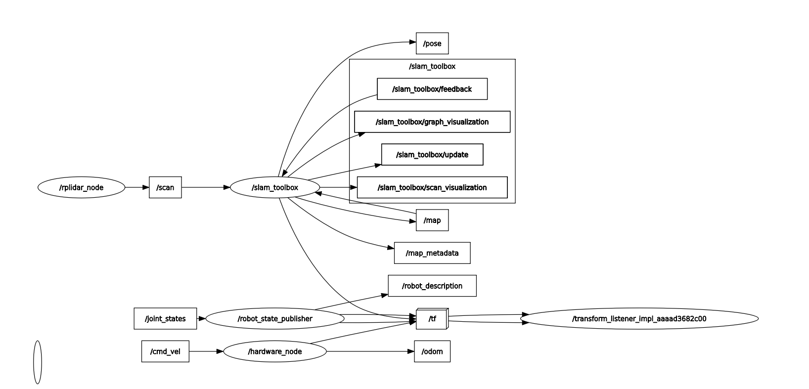 |
| 제어 노드 구조 | 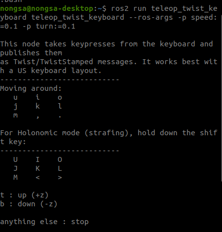 |
| 하드웨어 노드 실행 로그 | 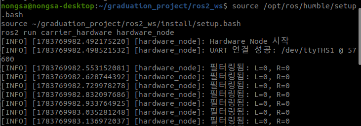 |
| 엔코더 피드백 파이프라인 구조 | 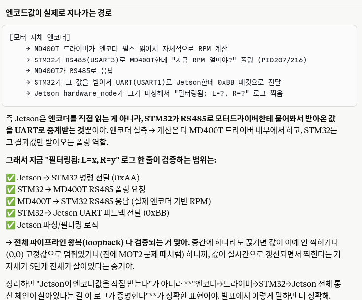 |

**검증 경로**: Jetson → STM32 (UART, 0xAA) → STM32 → MD400T (RS485 폴링) → STM32 → Jetson (UART, 0xBB 피드백)
전체 통신 왕복(loopback)이 정상 동작함을 실시간 RPM 피드백 로그로 확인.

---

## 2. MediaPipe 제스처 인식 및 모터 제어

카메라 입력(nvarguscamerasrc) 기반 MediaPipe 제스처 인식 → `/cmd_vel` 발행 → `carrier_hardware`가 STM32로 RPM 명령 전송.

| 제스처 | 이미지 |
|---|---|
| 카메라 인식 화면 | 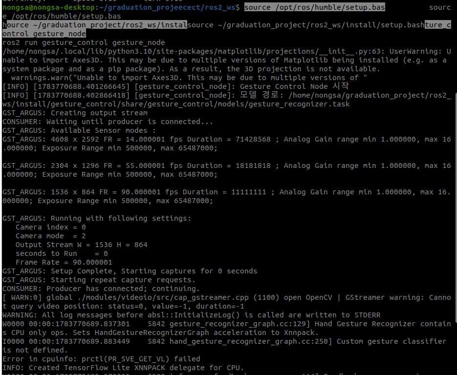 |
| 전진 (Come Closer) | 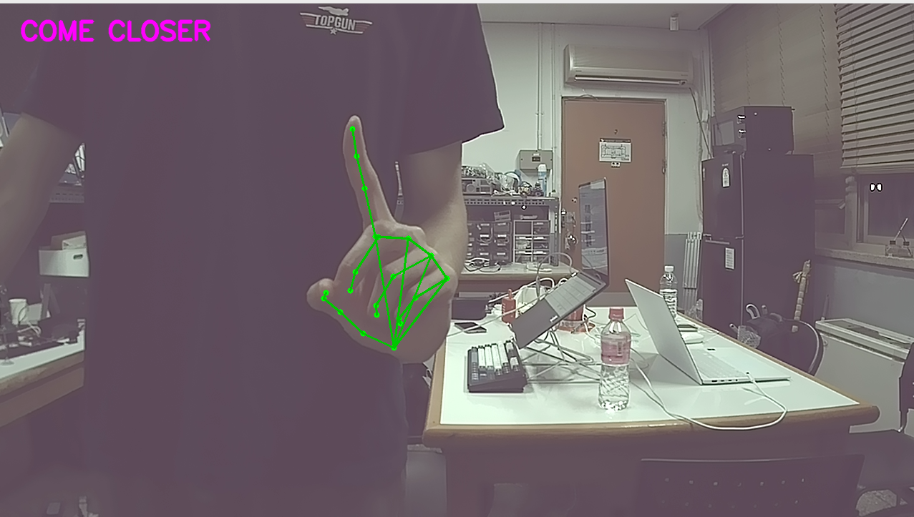 |
| 추종 (Follow) | 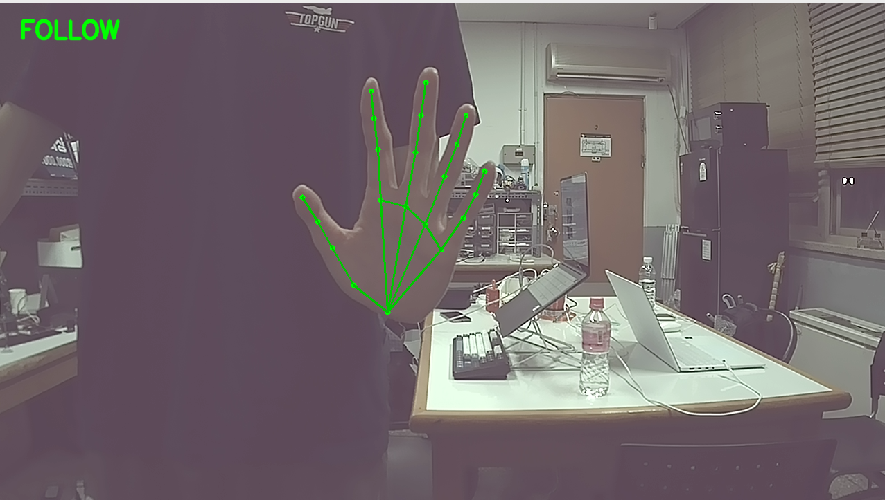 |
| 정지 (Stop) | 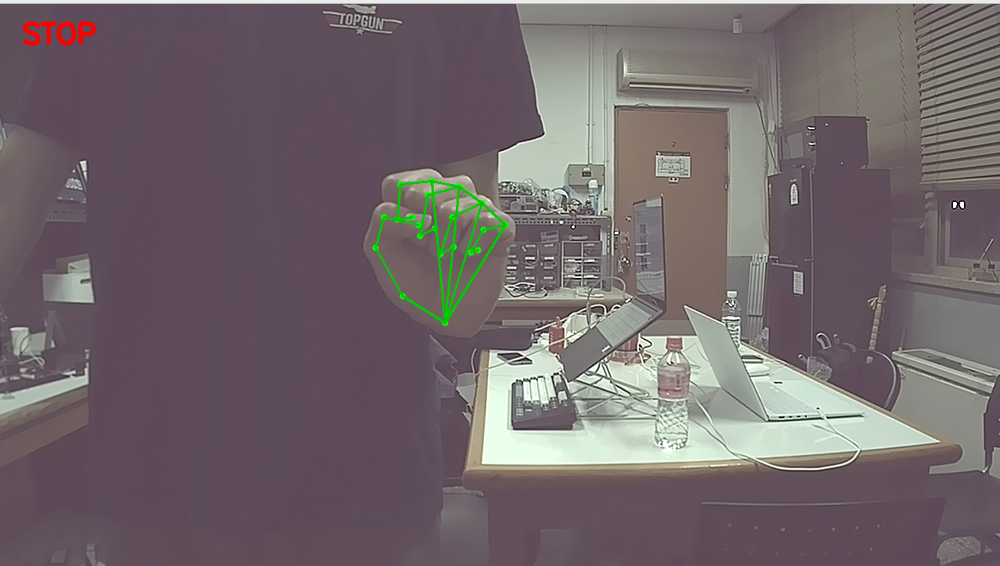 |
| 복귀 대기 (Return Wait) | 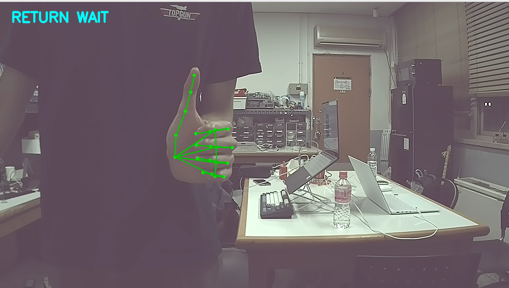 |
| 제스처 → 바퀴 제어 터미널 로그 | 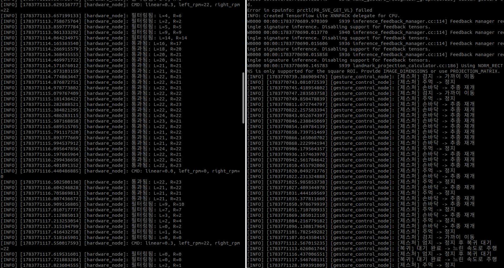 |

---

## 3. 모터 RPM 명령/피드백 검증

| 항목 | 이미지 |
|---|---|
| RPM 명령 전송 | 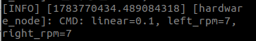 |
| 실제 구동 확인 | 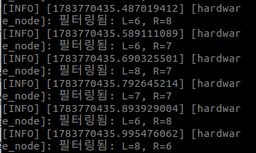 |
| 오도메트리 각속도 그래프 (rqt_plot) | 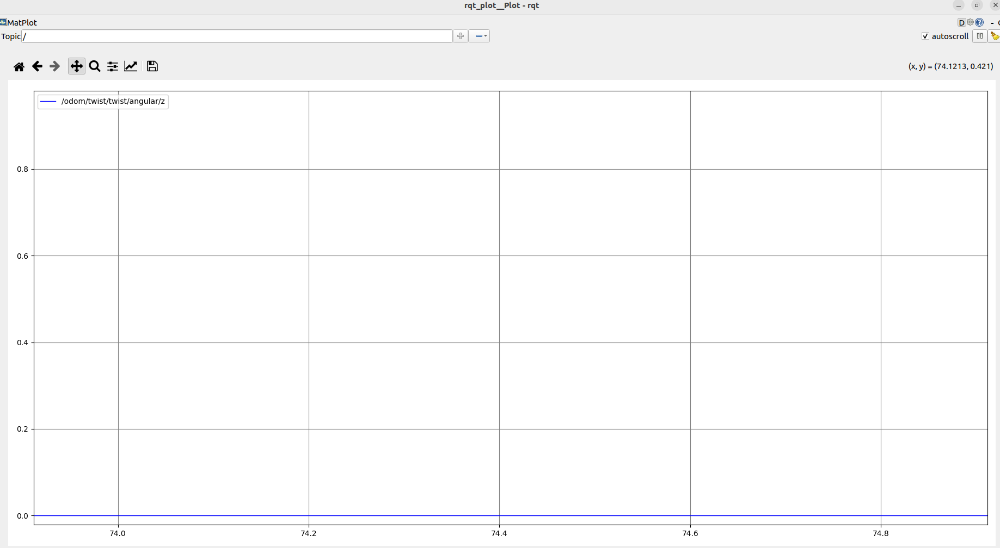 |

---

## 4. RPLiDAR S2 스캔 검증

| 항목 | 이미지 |
|---|---|
| RPLiDAR 노드 실행 | 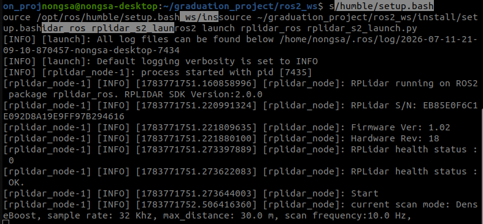 |
| Robot State Publisher / URDF | 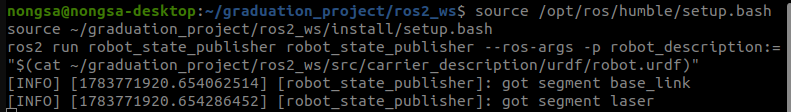 |
| 레이저 스캔 값 | 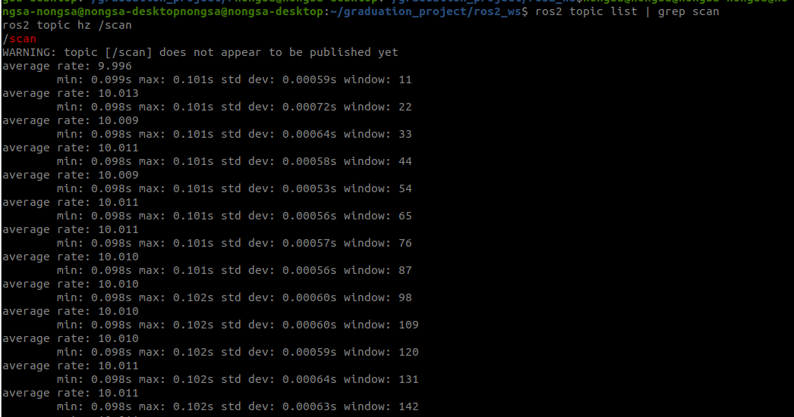 |
| 레이저 스캔 (하늘소 랩실) | 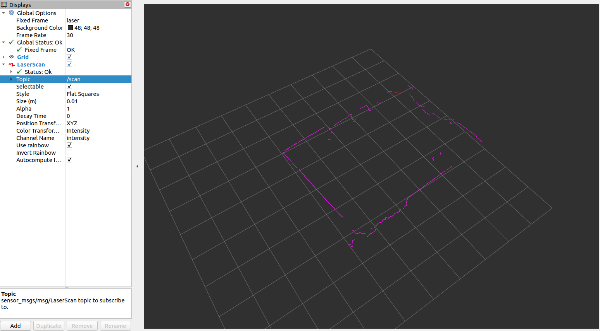 |

---

## 5. SLAM 매핑 결과

slam_toolbox (online_async) 기반 실내 매핑.

| 위치 | 이미지 |
|---|---|
| 랩실 지도 1 | 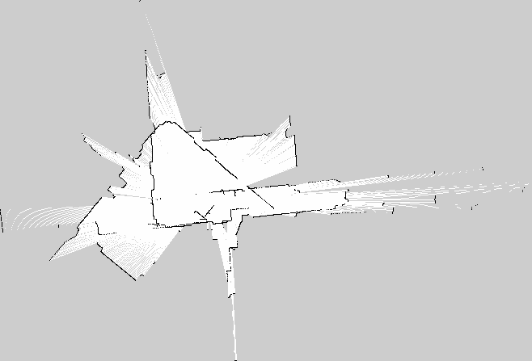 |
| 랩실 지도 2 |  |
| 하늘소관 지도 1 | 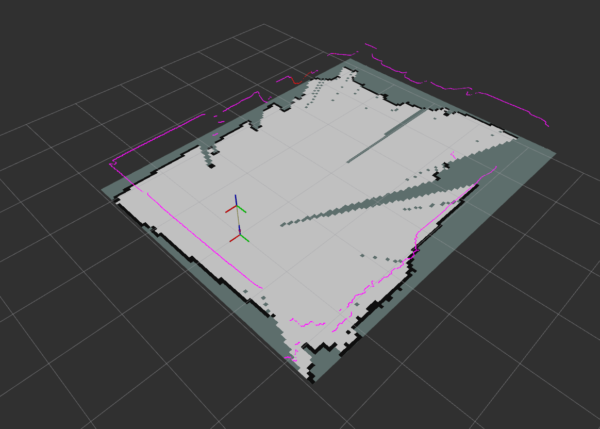 |
| 하늘소관 지도 2 | 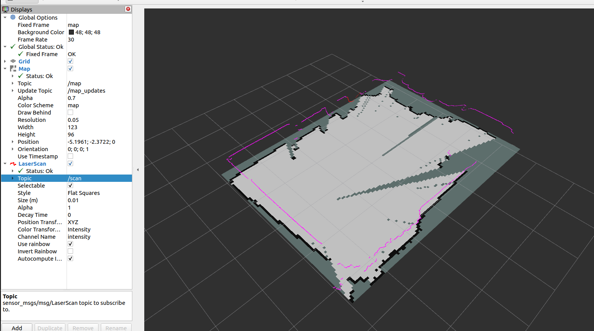 |
| 매핑 결과 1 | 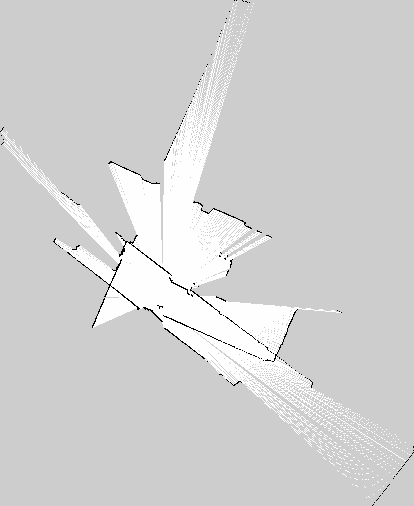 |
| 매핑 결과 2 |  |
| 매핑 결과 3 | 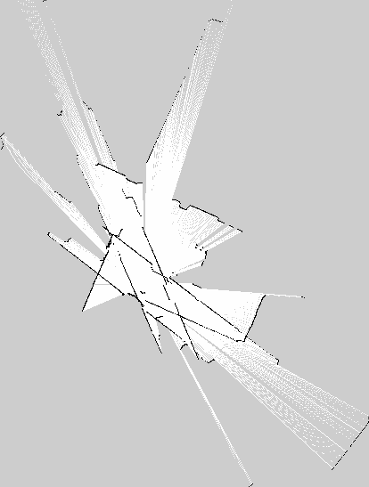 |
| 매핑 결과 4 | 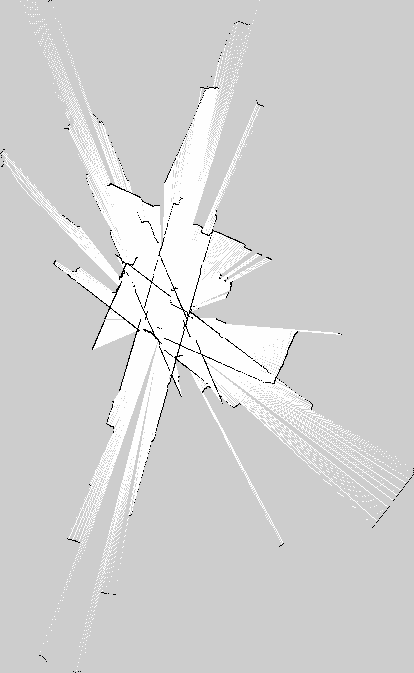 |
| slam_toolbox 노드 실행 | 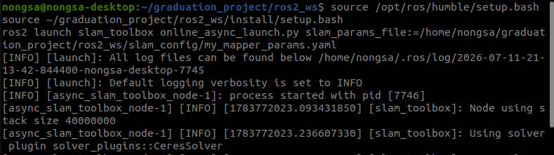 |

원본 맵 데이터(`.pgm`)는 `docs/robot_pictures/`에 함께 저장되어 있습니다 (`checkpoint4.pgm`, `checkpoint5.pgm`, `room_map.pgm` 등).

---

## Tech Stack

- **Compute**: Jetson Nano (ROS2 Humble)
- **MCU**: STM32H723 (FreeRTOS)
- **Motor Driver**: MD400T BLDC (RS485)
- **Sensors**: RPLiDAR S2, UWB DWM1001
- **Gesture Recognition**: MediaPipe
- **Navigation**: slam_toolbox → AMCL → Nav2 (예정)
EOF
